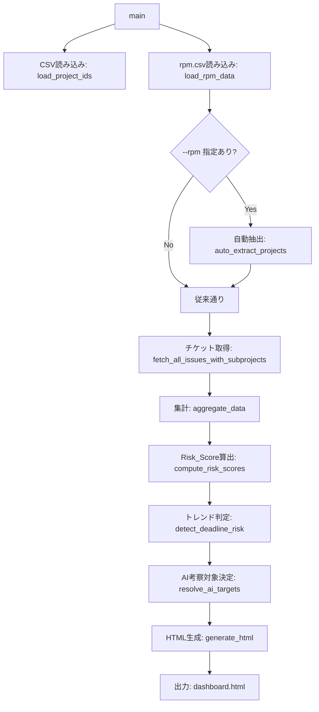
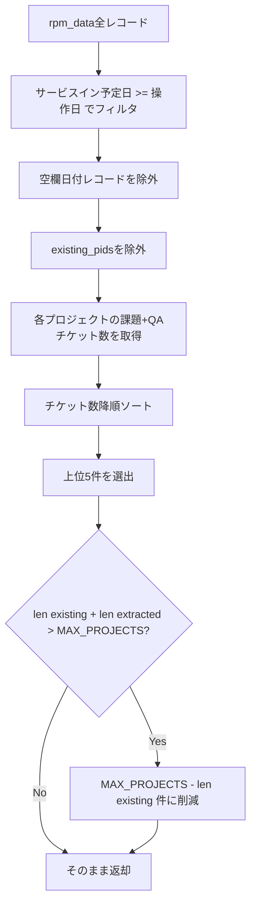
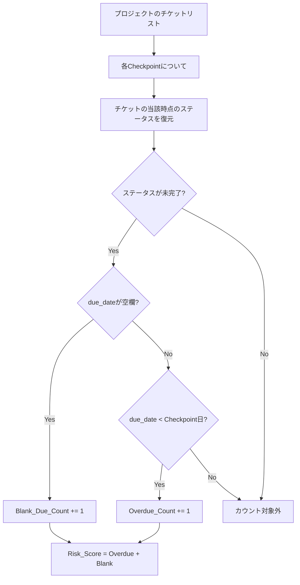

# 設計書: ダッシュボード機能拡張

## 概要

本設計書は、Redmineダッシュボードレポート（`dashboard_report.py`）に対する3つの機能拡張の技術設計を定義する。

1. **RPM_CSVからのプロジェクト自動抽出エンジン** — サービスイン予定日が近く、課題・QAチケットが多いプロジェクトを自動的にダッシュボード対象に追加する
2. **期限リスク検知** — 4定点のRisk_Score推移を分析し、上昇傾向にあるプロジェクトを視覚的に警告する
3. **一覧テーブルのフィルタ・ソートエンジン** — インラインJavaScriptによるクライアントサイドのフィルタリングとソート機能

既存の `dashboard_report.py` を拡張し、Python標準ライブラリのみ・完全オフラインHTML・デジタル庁デザインシステムv2準拠の制約を維持する。

### 設計方針

- 既存関数の変更は最小限に抑え、新機能は新関数として追加する
- `AI_MAX` を 5 → 10 に変更し、Deadline_Risk_Flag によるAI考察対象拡張に対応する
- フィルタ・ソートはインラインJavaScriptで実装し、外部ライブラリに依存しない
- すべてのロジック（自動抽出、Risk_Score算出、トレンド判定）は純粋関数として実装し、テスタビリティを確保する

## アーキテクチャ

### 処理フロー



### 既存関数への変更

| 関数 | 変更内容 |
|------|----------|
| `main()` | 自動抽出処理の呼び出し追加、Risk_Score算出・トレンド判定の呼び出し追加、AI考察対象決定ロジックの変更 |
| `generate_html()` | 一覧テーブルに「期限リスク」列追加、フィルタ・ソートJS挿入、自動抽出バッジ表示、AI_MAX=10対応 |
| `_render_ai_placeholder()` | `data-risk-scores` 属性の追加 |
| `aggregate_data()` | 変更なし（Risk_Score算出は別関数で実施） |

### 新規関数

| 関数 | 責務 |
|------|------|
| `auto_extract_projects()` | RPM_CSVからサービスイン予定日ベースでプロジェクトを自動抽出する |
| `fetch_issue_qa_count()` | 指定プロジェクトの課題+QAチケット総数をAPIから取得する |
| `compute_risk_scores()` | 各プロジェクト・各Checkpointの Overdue_Count, Blank_Due_Count, Risk_Score を算出する |
| `detect_deadline_risk()` | 4定点のRisk_Score推移からDeadline_Risk_Flagを判定する |
| `resolve_ai_targets()` | ai_flag + Deadline_Risk_Flag からAI考察対象プロジェクトを決定する（上限10件） |
| `_render_risk_score_table()` | 詳細ページ用のRisk_Score推移テーブルHTMLを生成する |
| `_render_filter_sort_js()` | フィルタ・ソート用のインラインJavaScriptを生成する |

## コンポーネントとインターフェース

### 1. 自動抽出エンジン（Auto_Extract_Engine）

```python
def auto_extract_projects(
    rpm_data: dict[str, dict],       # load_rpm_data()の戻り値
    existing_pids: list[str],        # Projects_CSVのプロジェクトIDリスト
    max_projects: int = 30,          # MAX_PROJECTS
    max_extract: int = 5,            # 自動抽出の最大件数
    today: datetime | None = None,   # テスト用の操作日注入（デフォルト: 現在日時）
) -> list[str]:
    """
    RPM_CSVからサービスイン予定日が操作日以降のプロジェクトを自動抽出する。

    処理手順:
    1. rpm_dataからサービスイン予定日が操作日以降のレコードを抽出
    2. existing_pidsに含まれるプロジェクトを除外
    3. 各プロジェクトの課題+QAチケット総数をAPIから取得
    4. チケット総数の降順で上位max_extract件を選出
    5. MAX_PROJECTSを超えない範囲で件数を調整

    戻り値: 自動抽出されたプロジェクトIDのリスト
    """
```

```python
def fetch_issue_qa_count(project_id: str) -> int:
    """
    指定プロジェクトの課題トラッカー + Q/Aトラッカーのオープンチケット総数を取得する。
    Redmine APIの /issues.json?project_id=X&tracker_id=Y&status_id=open を使用。
    プロジェクトが存在しない場合は -1 を返す。
    """
```

#### 自動抽出のフロー



### 2. 期限リスク検知（Deadline Risk Detection）

```python
def compute_risk_scores(
    projects_issues: dict[str, list[dict]],  # プロジェクトID → チケットリスト
    checkpoints: list[tuple[str, datetime]], # 4定点
    status_map: dict[str, str],              # ステータスID→名前マッピング
) -> dict[str, list[int]]:
    """
    各プロジェクト・各Checkpointの Risk_Score を算出する。

    Risk_Score = Overdue_Count + Blank_Due_Count
    - Overdue_Count: due_date < 操作日 かつ ステータスが未完了のチケット数
    - Blank_Due_Count: due_date が空欄 かつ ステータスが未完了のチケット数
    - 未完了 = ステータスが「解決」「終了」「却下」以外

    対象トラッカー: 課題、Q/A のみ

    戻り値: {project_id: [risk_score_3w, risk_score_2w, risk_score_1w, risk_score_now]}
    """
```

```python
# 完了ステータス名のセット（Overdue/Blank算出で除外する）
CLOSED_STATUSES = {"解決", "終了", "却下"}

def _is_overdue_at(issue: dict, checkpoint_dt: datetime, status_map: dict) -> bool:
    """指定時点でチケットが期限超過かどうかを判定する"""

def _is_blank_due_at(issue: dict, checkpoint_dt: datetime, status_map: dict) -> bool:
    """指定時点でチケットが期限未設定かどうかを判定する"""
```

```python
def detect_deadline_risk(
    risk_scores: dict[str, list[int]],  # compute_risk_scoresの戻り値
) -> dict[str, bool]:
    """
    4定点のRisk_Score推移から上昇傾向を判定する。

    判定ロジック:
    - 3区間（3w→2w, 2w→1w, 1w→now）のうち2区間以上でRisk_Scoreが増加 → 上昇傾向
    - 4定点すべてRisk_Score=0 → 上昇傾向ではない

    戻り値: {project_id: True/False}
    """
```

#### Risk_Score算出のフロー



### 3. AI考察対象決定

```python
def resolve_ai_targets(
    project_ids: list[str],           # 全プロジェクトIDリスト（CSV + 自動抽出）
    ai_flags: dict[str, bool],        # CSVのai_flag
    deadline_risk: dict[str, bool],   # detect_deadline_riskの戻り値
    ai_max: int = 10,                 # AI考察の上限
) -> set[str]:
    """
    AI考察対象プロジェクトを決定する。

    優先順位:
    1. CSVのai_flag=Trueのプロジェクト（project_idsの順序で）
    2. Deadline_Risk_Flag=Trueのプロジェクト（project_idsの順序で）
    重複は除外し、合計ai_max件まで。

    戻り値: AI考察対象のプロジェクトIDセット
    """
```

### 4. フィルタ・ソートエンジン（Filter/Sort Engine）

フィルタ・ソートはすべてインラインJavaScriptで実装する。`generate_html()` 内で `<script>` タグとして埋め込む。

```python
def _render_filter_sort_js() -> str:
    """
    フィルタ・ソート用のインラインJavaScriptを生成する。

    機能:
    - 各列ヘッダー直下のフィルタ入力欄（<input>）による部分一致フィルタ
    - 複数列のAND条件フィルタ
    - 列ヘッダークリックによる3段階ソート（昇順→降順→解除）
    - 数値列の数値比較ソート
    - ソートインジケーター（▲/▼）表示
    """
```

#### JavaScript設計

```javascript
// フィルタ処理
function applyFilters() {
    // テーブルID: "project-list-table"
    // フィルタ入力: class="col-filter" data-col="列インデックス"
    // 各行のセルテキストとフィルタ値を部分一致で比較
    // すべてのフィルタ条件をAND適用
    // 該当しない行は display:none
}

// ソート処理
// ソート状態: {col: number, dir: 'asc'|'desc'|'none'}
function sortTable(colIndex) {
    // 3段階トグル: none → asc → desc → none
    // 数値列（チケット数、課題、Q/A、サポート、成果物）は数値比較
    // テキスト列は文字列比較（localeCompare）
    // ソートインジケーター更新
    // 元の順序を data-original-index で保持
}
```

#### 一覧テーブルの列構成（変更後）

| 列 | 型 | フィルタ | ソート | 備考 |
|----|----|---------|--------|------|
| プロジェクト | テキスト | テキスト入力 | 文字列 | プロジェクト名 + identifier |
| 影響度 | テキスト | テキスト入力 | 文字列 | rpm.csvあり時のみ |
| 重要案件 | テキスト | テキスト入力 | 文字列 | rpm.csvあり時のみ |
| 新領域 | テキスト | テキスト入力 | 文字列 | rpm.csvあり時のみ |
| 工程 | テキスト | テキスト入力 | 文字列 | rpm.csvあり時のみ |
| 着手年月 | テキスト | テキスト入力 | 文字列 | rpm.csvあり時のみ |
| サービスイン | テキスト | テキスト入力 | 文字列 | rpm.csvあり時のみ |
| チケット数 | 数値 | テキスト入力 | 数値 | |
| 課題 | 数値 | テキスト入力 | 数値 | |
| Q/A | 数値 | テキスト入力 | 数値 | |
| サポート | 数値 | テキスト入力 | 数値 | |
| 成果物 | 数値 | テキスト入力 | 数値 | |
| 期限リスク | テキスト | テキスト入力 | 文字列 | **新規追加** |
| AI | テキスト | テキスト入力 | 文字列 | |

### 5. HTML生成の変更（generate_html）

#### 一覧ページの変更

1. `AI_MAX = 5` → `AI_MAX = 10` に変更
2. テーブルに `id="project-list-table"` を付与
3. 「期限リスク」列を追加（AI列の前）
4. 自動抽出プロジェクトに「🔍 自動抽出」バッジを表示
5. Deadline_Risk_Flagプロジェクトに「⚠ 期限リスク」バッジを表示（ツールチップ付き）
6. フィルタ入力行（`<tr>` with `<input>` elements）をヘッダー直下に追加
7. フィルタ・ソート用JavaScriptを `<script>` タグで埋め込み
8. 各行に `data-original-index` 属性を付与（ソート解除時の元順序復元用）

#### 詳細ページの変更

1. Risk_Score推移テーブルを追加（`_render_risk_score_table()`）
2. Deadline_Risk_FlagプロジェクトのAI考察プレースホルダーに `data-risk-scores` 属性を追加

### 6. ドキュメント更新

#### README.md

- 「ダッシュボードレポート」セクション内に以下を追記:
  - プロジェクト自動抽出機能の説明
  - 期限リスク検知機能の説明
  - フィルタ・ソート機能の操作方法
- 「制限事項」テーブルの「AI考察の上限」を5件→10件に更新
- SKILL.mdの「上限: 最大5件まで」を「上限: 最大10件まで」に更新

#### REFERENCE.md

- 「期限リスク検知」セクションを追加:
  - Risk_Score算出ロジック（Overdue_Count + Blank_Due_Count）
  - 完了ステータスの除外条件
  - 上昇傾向の判定基準（3区間中2区間以上増加）
  - Deadline_Risk_Flagの意味と表示

## データモデル

### 自動抽出関連

```python
# auto_extract_projects の入力: rpm_data
# 既存の load_rpm_data() の戻り値をそのまま使用
rpm_data: dict[str, dict] = {
    "project-001": {
        "子案件No": "project-001",
        "サービスイン予定日": "2025-09-30",
        "影響度区分": "大",
        ...
    }
}

# auto_extract_projects の出力
extracted_pids: list[str] = ["project-005", "project-008"]

# 自動抽出フラグ（generate_htmlに渡す）
auto_extracted: set[str] = {"project-005", "project-008"}
```

### Risk_Score関連

```python
# compute_risk_scores の出力
risk_scores: dict[str, list[int]] = {
    "project-001": [3, 5, 4, 7],   # [3週間前, 2週間前, 1週間前, 現在]
    "project-002": [0, 0, 0, 0],
}

# detect_deadline_risk の出力
deadline_risk: dict[str, bool] = {
    "project-001": True,   # 3→5（増加）, 5→4（減少）, 4→7（増加） → 2区間増加 → 上昇傾向
    "project-002": False,  # 全て0
}
```

### AI考察対象

```python
# resolve_ai_targets の出力
ai_targets: set[str] = {"project-001", "project-003", "project-005"}
# ai_flag=True のプロジェクト + Deadline_Risk_Flag=True のプロジェクト（合計10件まで）
```

### generate_html の引数追加

```python
def generate_html(
    tracker_stats, deliverable_data, checkpoints, project_ids,
    per_project_stats, per_project_deliverables, projects_issues,
    project_names=None, ai_flags=None, rpm_data=None,
    # --- 新規引数 ---
    auto_extracted=None,      # set[str]: 自動抽出されたプロジェクトIDセット
    risk_scores=None,         # dict[str, list[int]]: プロジェクト別Risk_Score
    deadline_risk=None,       # dict[str, bool]: Deadline_Risk_Flag
    ai_targets=None,          # set[str]: AI考察対象プロジェクトIDセット
):
```


## 正確性プロパティ

*プロパティとは、システムのすべての有効な実行において成立すべき特性や振る舞いのことである。人間が読める仕様と機械的に検証可能な正確性保証の橋渡しとなる形式的な記述である。*

### プロパティ1: RPMフィルタリングの正確性

*任意の* RPM_CSVデータセットと操作日に対して、`auto_extract_projects` が返すプロジェクトIDリストに含まれるすべてのプロジェクトは、RPM_CSV内でサービスイン予定日が操作日以降であり、かつサービスイン予定日が空欄でないレコードに対応するものでなければならない。

**検証対象: 要件 1.1, 1.9**

### プロパティ2: 自動抽出の選出と除外

*任意の* CSVプロジェクトリストとRPM候補リストに対して、`auto_extract_projects` が返すプロジェクトIDリストは、(a) CSVプロジェクトリストに含まれるプロジェクトを一切含まず、(b) チケット総数の降順で並んでおり、(c) 最大5件以下である。

**検証対象: 要件 1.3, 1.4**

### プロパティ3: 自動抽出のMAX_PROJECTS制限

*任意の* CSVプロジェクト数（1〜30）と自動抽出候補数（0〜10）に対して、CSVプロジェクト数と `auto_extract_projects` が返すプロジェクト数の合計は、MAX_PROJECTS（30）を超えてはならない。

**検証対象: 要件 1.7**

### プロパティ4: 自動抽出プロジェクトのai_flag無効

*任意の* 自動抽出されたプロジェクトに対して、そのプロジェクトの `ai_flag` は常に `False`（無効）でなければならない。

**検証対象: 要件 1.12**

### プロパティ5: Risk_Score算出の正確性

*任意の* チケットセット（様々なdue_date、ステータスの組み合わせ）と任意のCheckpoint日時に対して、Risk_Scoreは「ステータスが未完了（解決・終了・却下以外）であり、かつ期限超過または期限未設定であるチケットの数」と等しくなければならない。完了ステータス（解決・終了・却下）のチケットは、due_dateの値に関わらずRisk_Scoreに含まれてはならない。

**検証対象: 要件 2.1, 2.2, 2.10, 2.11**

### プロパティ6: 上昇傾向判定の正確性

*任意の* 4つのRisk_Score値のシーケンス `[s0, s1, s2, s3]` に対して、`detect_deadline_risk` は以下の条件を満たさなければならない: (a) 3区間 `(s0→s1, s1→s2, s2→s3)` のうち2区間以上で値が増加している場合のみ `True` を返す、(b) 4定点すべてが0の場合は `False` を返す。

**検証対象: 要件 2.3, 2.4, 2.7**

### プロパティ7: AI考察対象決定と上限

*任意の* プロジェクトリスト、ai_flagマッピング、Deadline_Risk_Flagマッピングに対して、`resolve_ai_targets` が返すAI考察対象セットは、(a) ai_flag=Trueまたは Deadline_Risk_Flag=Trueのプロジェクトのみを含み、(b) 合計10件以下であり、(c) ai_flag=Trueのプロジェクトが優先される。

**検証対象: 要件 2.12, 2.13**

## エラーハンドリング

### 自動抽出エンジン

| エラー状況 | 対処 |
|-----------|------|
| RPM_CSVのサービスイン予定日が不正な日付形式 | そのレコードをスキップし、stderrに警告を出力 |
| 自動抽出対象プロジェクトがRedmine上に存在しない | そのプロジェクトをスキップし、stderrに警告を出力（要件1.10） |
| Redmine APIエラー（401/403/500） | そのプロジェクトをスキップし、stderrにエラーを出力 |
| RPM_CSVが空ファイル | 自動抽出なし（0件）として正常終了 |
| サービスイン予定日が操作日以降のレコードが0件 | 自動抽出なし（0件）として正常終了 |

### Risk_Score算出

| エラー状況 | 対処 |
|-----------|------|
| Checkpointにチケットデータが存在しない | Risk_Score = 0 として扱う（要件2.8） |
| チケットのdue_dateが不正な形式 | 期限未設定（Blank_Due）として扱う |
| ステータスの復元に失敗 | 現在のステータスをフォールバックとして使用 |

### フィルタ・ソートエンジン

| エラー状況 | 対処 |
|-----------|------|
| フィルタ入力に特殊文字が含まれる | テキスト部分一致のため、正規表現は使用せず `indexOf` で比較 |
| ソート対象の値が空文字 | 空文字は最後尾に配置 |
| テーブルに行がない場合 | フィルタ・ソートは何もしない |

## テスト戦略

### テストアプローチ

本機能拡張では、**プロパティベーステスト**と**ユニットテスト**の二重アプローチでテストを実施する。

#### プロパティベーステスト

- ライブラリ: **Hypothesis**（Python用プロパティベーステストライブラリ）
- 各プロパティテストは最低100イテレーション実行
- 各テストにはコメントで設計書のプロパティ番号を参照
- タグ形式: **Feature: dashboard-enhancements, Property {番号}: {プロパティ名}**

対象プロパティ:
1. RPMフィルタリングの正確性（プロパティ1）
2. 自動抽出の選出と除外（プロパティ2）
3. 自動抽出のMAX_PROJECTS制限（プロパティ3）
4. 自動抽出プロジェクトのai_flag無効（プロパティ4）
5. Risk_Score算出の正確性（プロパティ5）
6. 上昇傾向判定の正確性（プロパティ6）
7. AI考察対象決定と上限（プロパティ7）

#### ユニットテスト（例示ベース）

- 既存の `test_dashboard.py` を拡張し、新機能のモックデータテストを追加
- 以下のテストケースを追加:
  - 自動抽出バッジの表示確認
  - 期限リスクバッジの表示確認
  - Risk_Scoreテーブルの表示確認
  - フィルタ入力欄の存在確認
  - ソートインジケーターの存在確認
  - 「期限リスク」列の存在確認
  - data-risk-scores属性の存在確認

#### インテグレーションテスト

- `test_dashboard.py` / `test_dashboard_20prj.py` を拡張し、自動抽出・Risk_Score・フィルタ・ソートを含むHTMLを生成
- 生成されたHTMLをブラウザで開いて目視確認

#### スモークテスト

- 生成されたHTMLに外部ライブラリの参照がないことを確認
- フィルタ入力欄にデジタル庁デザインシステムv2準拠のスタイルが適用されていることを目視確認
- README.md / REFERENCE.md に新機能の説明が含まれることを確認

### テストファイル構成

```
scripts/
├── test_dashboard.py              # 既存テスト（拡張）
├── test_dashboard_20prj.py        # 既存負荷テスト（拡張）
└── test_properties.py             # 新規: プロパティベーステスト
```

### プロパティベーステストの実行

```bash
# Hypothesisのインストール（テスト実行時のみ必要）
pip install hypothesis

# プロパティテスト実行
python -m pytest scripts/test_properties.py -v

# 既存テスト実行（変更なし）
python scripts/test_dashboard.py
```

> 注: `dashboard_report.py` 本体は標準ライブラリのみで動作する。Hypothesisはテスト実行時のみ必要であり、本番コードには影響しない。
